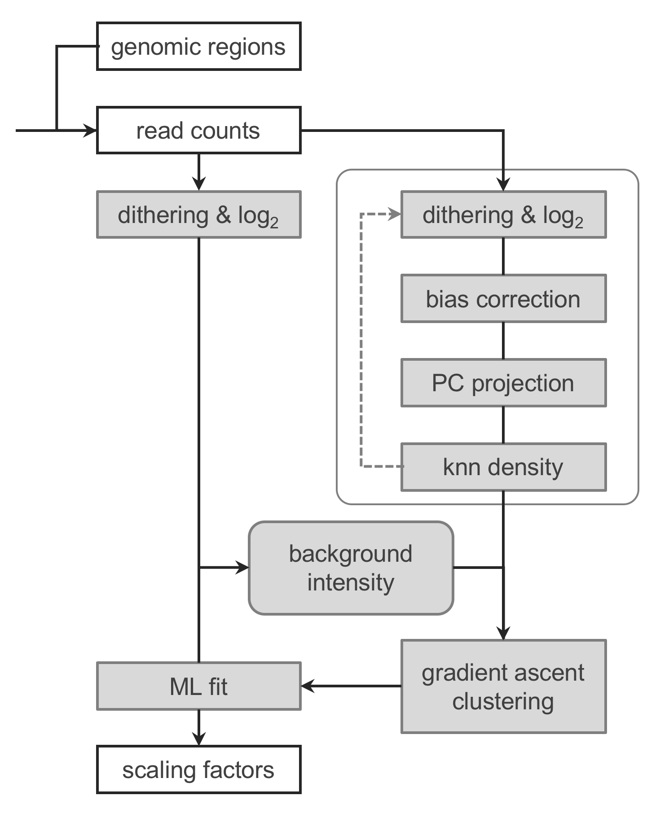

```{r hidden_dependencies, include=FALSE}
library(knitr)
library(data.table)
library(Tightrope)
```

The purpose of this document is to provide a practical guide to the use of
`R` functions available in `Tightrope`. A basic knowledge of the `R` syntax
and data structures, and of Bioconductor objects used to represent and
manipulate mapped reads and genomic intervals will help to understand
and adapt the following source code examples to another ChIP-seq dataset.

# Introduction

`Tightrope` is an `R` package proposing a ChIP-seq normalization method, named
Background Read Density (BRD)[<sup>1,2</sup>](#1), capable of accurate
estimation of normalization factors in conditions involving global variations
of chromatin marks.

It has been shown that basic sequencing depth correction can be dramatically
misleading in these experimental conditions, and the fact that such experiments
are important for ongoing research on chromatin regulation and cancer has
increased the need for validated normalization methods in the field of
chromatin genomics.

In the recent years, spike-in protocols[<sup>3-6</sup>](#1) were introduced to
circumvent ChIP-seq normalization issues with an accessible experimental
strategy. Seeking an alternative strategy due to reliability concerns with
our own spike-in attempts, we used an empirical computational approach
to design the BRD method while we were studying H3K27me3 profiles in a cellular
model of DIPG[<sup>1</sup>](#5).

After the initial validation and successful application of the BRD normalization
with H3K27me3, we redesigned the underlying algorithm to achieve accurate
normalizations with various experimental setups and chromatin marks.
Following these improvements, we are currently preparing the manuscript
describing the BRD method and presenting comparative analyses between spike-in
and BRD normalizations for different datasets[<sup>2</sup>](#2).

## Overview of the BRD method

```{r overview, echo=FALSE, out.width="40%"}

```

# Installations

The following softwares must be installed before `Tightrope` can be used.

  - [R environment](https://www.r-project.org/) version 3.4 or newer.
  - To develop and execute `R` scripts we recommend using [RStudio](https://www.rstudio.com/products/rstudio/download).
  - CRAN packages `devtools`, `stringr`, `triangle`, `caTools`, `ica`, `FNN`, `igraph`, `mixtools`.
  - [Bioconductor](http://www.bioconductor.org/) packages `Rsamtools`, `GenomicAlignments`, `GenomicRanges`, `GenomicFeatures`, `rtracklayer`, `biomaRt`.
  - GitHub package [Barbouille](https://github.com/benja0x40/Barbouille).

The next subsections provide further indications for these installations.

## R and RStudio environments

If `R` and RStudio are not already installed.
  
  * Manually download and install [R](https://cloud.r-project.org).
    
  * Manually download and install [RStudio](https://www.rstudio.com/products/rstudio/download).

## Required packages

Once `R` and RStudio are installed, open RStudio and run the `R` code below
which should install all required packages automatically. While `R` will perfom
these tasks, you may be prompted for a confirmation of package installations
or updates.

```R
# Setting value below to TRUE will reinstall all required packages (optional)
reinstall <- FALSE

# Detect already installed packages
pkg <- ifelse(reinstall, c(), installed.packages()[, "Package"])

# CRAN packages
lst <- c(
  "devtools", "stringr", "triangle", "caTools", "ica", "FNN", "igraph", "mixtools"
)
lst <- setdiff(lst, pkg)
if(length(lst) > 0) install.packages(lst, dependencies = T)

# Bioconductor packages
source("https://bioconductor.org/biocLite.R")
lst <- c(
  "Rsamtools", "GenomicAlignments", "GenomicRanges", "GenomicFeatures",
  "rtracklayer", "biomaRt"
)
lst <- setdiff(lst, pkg)
if(length(lst) > 0) biocLite(lst)

# GitHub packages
library("devtools")
install_github("benja0x40/Barbouille", dependencies = T)
```

## Tightrope

Install `Tightrope` using RStudio as follows:

  * Open menu `Tools > Install Packages...`

  * Select `Install from: Package Archive File (.tgz; .tar.gz)`
  
  * Browse your computer to select the package archive file (e.g. `Tightrope_0.5.1.tar.gz`)
  
  * Click `Install`

Once `Tightrope` is installed, the first thing to do when starting a work
session is to load the package into the active `R` session.

```{r}
 # Load Tightrope package (this will produce numerous messages)
library(Tightrope)
```

At this stage, it is possible to obtain the list of `R` functions available
in `Tightrope` and to browse the builtin documentation by calling the `help()`
function in the `R` console.

```{r}
help(package = "Tightrope")
```

# Data preparation

## Genomic regions

## Read count matrixes

## Data included with Tightrope

### Genome annotations

### Precomputed read counts

```{r show_dataset, echo=FALSE, out.width="50%"}
# kable(META, caption = "ChIP-seq experiments")
```

# Normalization

## Data from Orlando et al. 2014

```{r}
# Human genome annotations
data("EGA91_human")    # Gene features from Ensembl
data("hg38_blacklist") # Blacklisted regions from ENCODE
data("CGI_hg38")       # CpG Islands from UCSC
```

```{r}
data("Orlando_METADATA") # Annotation of experimental conditions
data("Orlando_COUNTS")   # Precomputed read count matrixes
data("Orlando_SPIKEIN")  # Number of Drosophila reads (spike-in) 
```

### H3K79me2

```{r}
chip <- Orlando_METADATA[antibody == "H3K79me2" & replicate == "2"]$sample_id
ctrl <- Orlando_METADATA[antibody == "Input" & replicate == "2"]$sample_id
```

```{r}
cat("List of ChIP-seq samples:", paste(chip, collapse = ", "), sep = "\n")
```

```{r}
cat("List of Input samples:", paste(ctrl, collapse = ", "), sep = "\n")
```

```{r}
# Use read counts over TSS as reference for BRD normalization
ref <- Orlando_COUNTS$GNU[, c(chip, ctrl)]
```

```{r}
brd <- BRD(ref, controls = ctrl, ncl = 2, bdt = c(0.2, 0.03))
```

```{r fig.height=6.5, out.width="30%"}
par(pch = 20, mar = c(4.5, 4.5, 1, 1), cex = 1.5) # Adjust graphic options
PlotBRD(brd)                                      # Show the BRD results
```

```{r}
cnt <- Orlando_COUNTS$TSS[, c(chip, ctrl)] # Extract read counts over TSS
```

```{r}
l2c <- log2(DitherCounts(cnt)) # Apply dithering and log2 transformation
```

```{r}
# Apply BRD normalization factors
nrm.brd <- t(t(l2c) + brd$normfactors[c(chip, ctrl)])
```

```{r}
# Apply spike-in normalization
spk <- Orlando_SPIKEIN[c(chip, ctrl)] # Extract Drosophila read counts
spk <-  log2(mean(spk) / spk)         # Compute normalization factors
nrm.spk <- t(t(l2c) + spk)            # Apply normalization factors

# Apply spike-in normalization
spk <- Orlando_METADATA$Drosophila.Unique.Reads
names(spk) <- Orlando_METADATA$sample_id
spk <- spk[c(chip, ctrl)]             # Extract Drosophila read counts
spk <-  log2(mean(spk) / spk)         # Compute normalization factors
nrm.spk <- t(t(l2c) + spk)            # Apply normalization factors
```

```{r}
# Create a color mapping function to represent read count distributions 
cmf <- function(k) colorize(k, mode = "01", col = "Wry")
```

```{r Orlando_H3K79me2, eval=FALSE}
# Adjust plot margins to show the name of experimental conditions
par(mar = c(12, 4.5, 3, 1), cex.main = 1.2, cex.lab = 1.1, cex.axis = 1.1) 

# Show read count distributions after spike-in and BRD normalizations
r <- SideBySideDensity(
  nrm.spk, nx = ncol(nrm.spk) * 25, ny = 150, method = "ash", spacing = 0.4,
  mapper = cmf, las = 2, main = "spike-in"
)
r <- SideBySideDensity(
  nrm.brd, nx = ncol(nrm.brd) * 25, ny = 150, method = "ash", spacing = 0.4,
  mapper = cmf, las = 2, main = "BRD"
)
```

```{r show_Orlando_H3K79me2, echo=FALSE, fig.height=5.5, out.width="40%", ref.label='Orlando_H3K79me2'}
```

### H3K4me3

```{r}
chip <- Orlando_METADATA[antibody == "H3K4me3"]$sample_id
ctrl <- Orlando_METADATA[antibody == "Input"]$sample_id
```

```{r}
# Use read counts over TSS as reference for BRD normalization
ref <- Orlando_COUNTS$TSS[, c(chip, ctrl)]
```

```{r}
brd <- BRD(ref, controls = ctrl, ncl = 2, bdt = c(0.2, 0.03))
```

```{r fig.height=6.5, out.width="30%"}
par(pch = 20, mar = c(4.5, 4.5, 1, 1), cex = 1.5) # Adjust graphic options
PlotBRD(brd)                                      # Show the BRD results
```

```{r}
# Extract read counts over TSS
cnt <- Orlando_COUNTS$TSS[, c(chip, ctrl)]
# Apply dithering and log2 transformation
l2c <- log2(DitherCounts(cnt))

# Apply BRD normalization factors
nrm.brd <- t(t(l2c) + brd$normfactors[c(chip, ctrl)])

# Apply spike-in normalization 
spk <- Orlando_SPIKEIN[c(chip, ctrl)] # Extract Drosophila read counts
spk <-  log2(mean(spk) / spk)         # Compute normalization factors
nrm.spk <- t(t(l2c) + spk)            # Apply normalization factors
```

```{r Orlando_H3K4me3, eval = FALSE}
# Adjust plot margins to show the name of experimental conditions
par(mar = c(12, 4.5, 3, 1), cex.main = 1.2, cex.lab = 1.1, cex.axis = 1.1) 

# Show read count distributions after spike-in and BRD normalizations
r <- SideBySideDensity(
  nrm.spk, nx = ncol(nrm.spk) * 25, ny = 150, method = "ash", spacing = 0.4,
  mapper = cmf, las = 2, main = "spike-in"
)
r <- SideBySideDensity(
  nrm.brd, nx = ncol(nrm.brd) * 25, ny = 150, method = "ash", spacing = 0.4,
  mapper = cmf, las = 2, main = "BRD"
)
```

```{r show_Orlando_H3K4me3, echo=FALSE, fig.height=5.5, out.width="40%", ref.label='Orlando_H3K4me3'}
```

## H3K27me3 datasets

```{r}
# Mouse genome annotations
data("EGA91_mouse")    # Gene features from Ensembl
data("mm10_blacklist") # Blacklisted regions from ENCODE
data("CGI_mm10")       # CpG Islands from UCSC
```

### ESC

```{r}
data("ESC_BRD_METADATA") # Annotation of experimental conditions
data("ESC_BRD_COUNTS")   # Precomputed read count matrixes
data("ESC_BRD_SPIKEIN")  # Number of Drosophila reads (spike-in) 
```

```{r}
chip <- ESC_BRD_METADATA[antibody == "H3K27me3" & replicate == "R2"]$sample_id
ctrl <- ESC_BRD_METADATA[antibody == "Input" & replicate == "R2"]$sample_id
```

```{r}
# Use read counts over gene units as reference for BRD normalization
ref <- ESC_BRD_COUNTS$GNU[, c(chip, ctrl)]
```

```{r}
brd <- BRD(ref, controls = ctrl, ncl = 2, bdt = c(0.2, 0.03))
```

```{r echo=FALSE, fig.height=6.5, out.width="30%"}
par(pch = 20, mar = c(4.5, 4.5, 1, 1), cex = 1.5) # Adjust graphic options
PlotBRD(brd)                                      # Show the BRD results
```

```{r}
# Extract read counts over CGIs
cnt <- ESC_BRD_COUNTS$CGI_UCSC[, c(chip, ctrl)]
# Apply dithering and log2 transformation
l2c <- log2(DitherCounts(cnt))

# Apply BRD normalization factors 
nrm.brd <- t(t(l2c) + brd$normfactors[c(chip, ctrl)])

# Apply spike-in normalization 
spk <- ESC_BRD_SPIKEIN[c(chip, ctrl)] # Extract Drosophila read counts
spk <-  log2(mean(spk) / spk)         # Compute normalization factors
nrm.spk <- t(t(l2c) + spk)            # Apply normalization factors
```

```{r ESC_BRD, eval=FALSE, include=FALSE}
# Adjust plot margins to show the name of experimental conditions
par(mar = c(12, 4.5, 3, 1), cex.main = 1.2, cex.lab = 1.1, cex.axis = 1.1) 

# Show read count distributions after spike-in and BRD normalizations
r <- SideBySideDensity(
  nrm.spk, nx = ncol(nrm.spk) * 25, ny = 150, method = "ash", spacing = 0.4,
  mapper = cmf, las = 2, main = "spike-in"
)
r <- SideBySideDensity(
  nrm.brd, nx = ncol(nrm.brd) * 25, ny = 150, method = "ash", spacing = 0.4,
  mapper = cmf, las = 2, main = "BRD"
)
```

```{r show_ESC_BRD, echo=FALSE, fig.height=5.5, out.width="40%", ref.label='ESC_BRD'}
```

### NSC

```{r}
data("NSC_K27M_METADATA") # Annotation of experimental conditions
data("NSC_K27M_COUNTS")   # Precomputed read count matrixes
data("NSC_K27M_SPIKEIN")  # Number of Drosophila reads (spike-in) 
```

```{r}
chip <- NSC_K27M_METADATA[antibody == "H3K27me3"]$sample_id
ctrl <- NSC_K27M_METADATA[antibody == "Input"]$sample_id
```

```{r}
# Use read counts over gene units as reference for BRD normalization
ref <- NSC_K27M_COUNTS$GNU[, c(chip, ctrl)]
```

```{r}
brd <- BRD(ref, controls = ctrl, ncl = 1, bdt = c(0.2, 0.03))
```

```{r echo=FALSE, fig.height=6.5, out.width="30%"}
par(pch = 20, mar = c(4.5, 4.5, 1, 1), cex = 1.5) # Adjust graphic options
PlotBRD(brd)                                      # Show the BRD results
```

```{r}
# Extract read counts over CGIs
cnt <- NSC_K27M_COUNTS$CGI_UCSC[, c(chip, ctrl)]
# Apply dithering and log2 transformation
l2c <- log2(DitherCounts(cnt))

# Apply BRD normalization factors 
nrm.brd <- t(t(l2c) + brd$normfactors[c(chip, ctrl)])

# Apply spike-in normalization 
spk <- NSC_K27M_SPIKEIN[c(chip, ctrl)] # Extract Drosophila read counts
spk <-  log2(mean(spk) / spk)          # Compute normalization factors
nrm.spk <- t(t(l2c) + spk)             # Apply normalization factors
```

```{r NSC_K27M, eval=FALSE, include=FALSE}
# Adjust plot margins to show the name of experimental conditions
par(mar = c(12, 4.5, 3, 1), cex.main = 1.2, cex.lab = 1.1, cex.axis = 1.1) 

# Show read count distributions after spike-in and BRD normalizations
r <- SideBySideDensity(
  nrm.spk, nx = ncol(nrm.spk) * 25, ny = 150, method = "ash", spacing = 0.4,
  mapper = cmf, las = 2, main = "spike-in"
)
r <- SideBySideDensity(
  nrm.brd, nx = ncol(nrm.brd) * 25, ny = 150, method = "ash", spacing = 0.4,
  mapper = cmf, las = 2, main = "BRD"
)
```

```{r show_NSC_K27M, echo=FALSE, fig.height=5.5, out.width="40%", ref.label='NSC_K27M'}
```

# DRAFTS

```{r eval=FALSE, fig.height=3.1, fig.width=3.1, include=FALSE}
CGI <- resize(CGI_hg38, width = 4000, fix = "center", use.names = F)
blacklist <- hg38_blacklist

CGI <- resize(CGI_mm10, width = 4000, fix = "center", use.names = F)
blacklist <- mm10_blacklist

chip <- META[antibody == "H3K79me2"]$sample_id
ctrl <- META[antibody == "Input"]$sample_id

chip <- META[antibody == "H3K27me3" & replicate == "R2"]$sample_id
ctrl <- META[antibody == "Input" & replicate == "R2"]$sample_id

ref <- COUNTS$GNU[, c(chip, ctrl)]
chk <- FiniteValues(log2(ref))
brd <- BRD(ref[chk, ], controls = ctrl, ncl = 2, bdt = c(0.2, 0.03))

chk <- countOverlaps(CGI, blacklist) == 0
cnt <- COUNTS$CGI_UCSC[chk, c(chip, ctrl)]
l2c <- log2(DitherCounts(cnt))

nrm.brd <- t(t(l2c) + brd$normfactors)
```

# References

<a name="5"></a>1. Mohammad et al. 2017 - *EZH2 is a potential therapeutic target for H3K27M-mutant pediatric gliomas.*  
[publisher](https://dx.doi.org/10.1038/nm.4293) | [pubmed](https://www.ncbi.nlm.nih.gov/pubmed/28263309)

<a name="5"></a>2. Leblanc B., Mohammad F., Hojfeldt J., Helin K. - *Normalization of ChIP-seq experiments involving global variations of chromatin marks.*  
(in preparation)

<a name="1"></a>3. Bonhoure et al. 2014 - *Quantifying ChIP-seq data: a spiking method providing an internal reference for sample-to-sample normalization*  
[publisher](https://dx.doi.org/10.1101/gr.168260.113) | [pubmed](https://www.ncbi.nlm.nih.gov/pubmed/24709819)

<a name="2"></a>4. Orlando et al. 2014 - *Quantitative ChIP-Seq normalization reveals global modulation of the epigenome.*  
[publisher](https://dx.doi.org/10.1016/j.celrep.2014.10.018) | [pubmed](https://www.ncbi.nlm.nih.gov/pubmed/25437568)

<a name="3"></a>5. Hu et al. 2015 - *Biological chromodynamics: a general method for measuring protein occupancy across the genome by calibrating ChIP-seq.*  
[publisher](https://dx.doi.org/10.1093/nar/gkv670) | [pubmed](https://www.ncbi.nlm.nih.gov/pubmed/26130708)

<a name="4"></a>6. Egan et al. 2016 - *An Alternative Approach to ChIP-Seq Normalization Enables Detection of Genome-Wide Changes in Histone H3 Lysine 27 Trimethylation upon EZH2 Inhibition.*  
[publisher](https://dx.doi.org/10.1371/journal.pone.0166438) | [pubmed](https://www.ncbi.nlm.nih.gov/pubmed/27875550)
