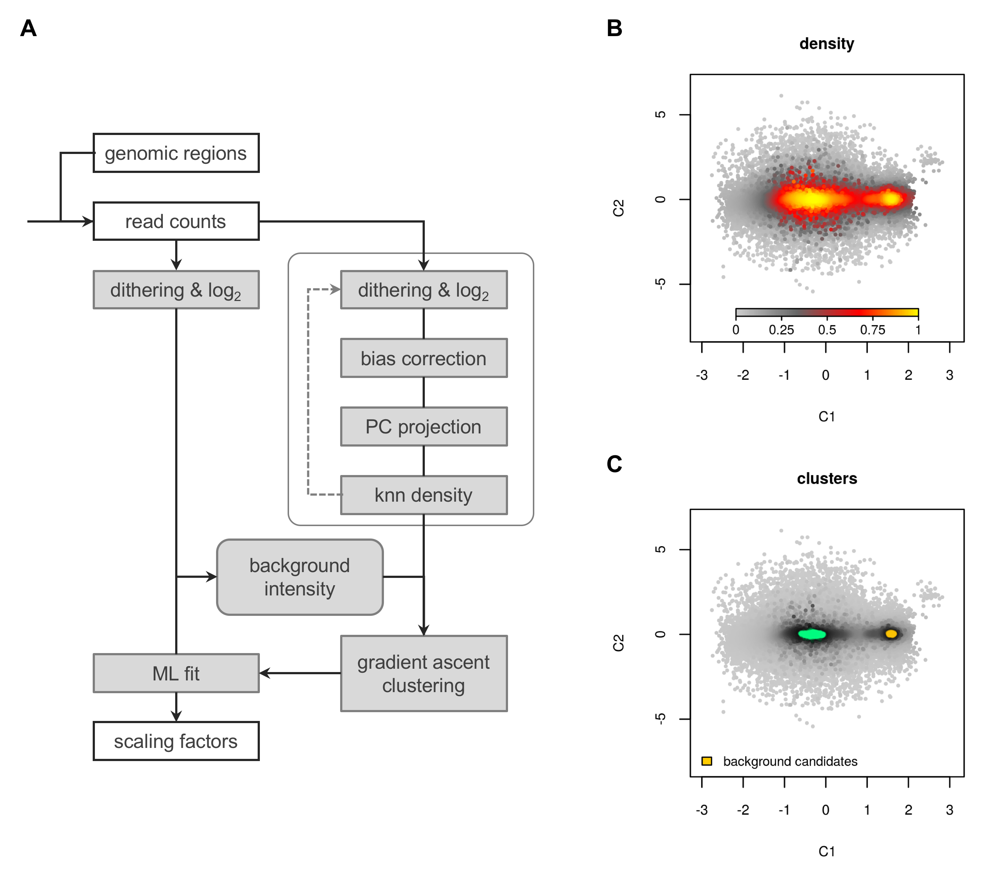

```{r hidden_dependencies, include=FALSE}
library(knitr)
suppressPackageStartupMessages(library(Tightrope))
```

___

The purpose of this document is to provide a practical guide to the use of
`R` functions available in `Tightrope`. A basic knowledge of the `R` syntax
and data structures, and of [Bioconductor](http://www.bioconductor.org/)
objects used to represent and manipulate mapped reads and genomic intervals
will help to understand and adapt the included source code examples to other
ChIP-seq datasets.

___

\newpage

# Introduction

`Tightrope` is an `R` package proposing a ChIP-seq normalization method, named
Background Read Density (BRD)^[1,2](#R1)^, capable of accurate estimation
of normalization factors in conditions involving global variations of chromatin
marks.

Basic sequencing depth correction can be dramatically misleading in such
experimental conditions, and since these experiments have become important 
for research on chromatin regulation and in specific cancer studies, accurate
ChIP-seq normalization methods are increasingly needed.

In the recent years, several spike-in protocols^[3-6](#R3)^ were introduced to
circumvent ChIP-seq normalization issues with an accessible experimental
strategy. Seeking an alternative due to reliability concerns with our own
spike-in attempts, we used an empirical computational approach to design
the BRD method while we were studying H3K27me3 profiles in a cellular model
of Diffuse Intrinsic Pontine Glioma (DIPG)^[1](#R1)^.

After initial validation and application of the BRD normalization to these
H3K27me3 ChIP-seq experiments, we used original data and published datasets to
significantly improve the versatility and reliability of our method.
As illustrated by the examples included in this document, with different
experimental setups and chromatin marks this improved BRD method leads to
normalizations that are rather equivalent to spike-in-based normalizations or
which are the most consistent ones in cases where both methods differ
noticeably.

Following these developments, we are now preparing a manuscript describing
the BRD method and reporting our comparative analyses between spike-in and
BRD normalizations for the most representative datasets^[2](#R2)^.

## Principle and prerequisites

The BRD normalization aims to rescale read counts or genomic coverage values
from different ChIP-seq experiments, such that background levels - which should
correspond mainly to ChIP-seq reads from non-specific DNA fragments - become
equalized between the experimental conditions.

To achieve this goal the BRD method is designed upon the following assumptions
and prerequisites.

  a. For all considered experimental conditions, some portions of the genome are
     invariably devoid of the immuno-precipitated chromatin mark.
   
     We use the term **background candidates** to designate such invariable
     genomic regions in a given experimental setup.
   
  b. Background candidates can be distinguished as a specific density mode in
     appropriately transformed ChIP-seq read count distributions.

A first prerequisite when applying the BRD method is to define the portions of
the genome that are biologically relevant for the search of background
candidates.

Although a completely naive search of background candidates among the whole
genome should be possible in theory, without further assumptions this search
may not lead to the selection of valid candidates.
For instance, some chromatin marks can cover most of the genome at low but
distinguishable levels, as it can be observed with H3K27me3 ChIP-seq profiles
in populations of Embryonic Stem Cells (ESCs) or Neural Stem Cells (NSCs).
In such situation the second assumption (**b.** above) of the BRD method does
not hold since the density mode of background candidates can be masked
by a close and more prevalent mode corresponding to minimal but extensive
ChIP enrichments.

For commonly studied marks that are linked with the regulation of gene
expression, a reasonable option consist in searching background candidates
over gene units or transcription start sites (TSS), assuming
that the mark of interest would be always absent at a subpopulation
of genes, for instance the constitutively expressed ones or silent ones in the
considered experimental conditions. 

The second prerequisite is that the ChIP-seq dataset must include background
profiles (e.g. input DNA, ChIP-seq performed with IgG or in KO conditions),
preferably generated using the same sequencing setup as for the ChIP profiles.
For technical reasons, 2 background profiles is the minimum for the current
version of `Tightrope`.

## Technical overview

The figure below illustrates a ChIP-seq normalization workflow with the current
version of `Tightrope`, giving an overview of algorithms implemented in its
core functions (**A**), as well as examples of resulting control graphs
(**B,C**) which provide guidance for the choice of parameters required by these
functions.

```{r overview, echo=FALSE, out.width="80%", fig.align='center'}

```

As shown in this workflow, the BRD method consists mainly in the transformation
of read counts over chosen genomic regions (**A**) into a bivariate density 
distribution (**B**), a technique that we name Count Density after Dithering
and Dimensionality Reduction (CDaDaDR) which combines a principal component
analysis and a non-parametric density estimation, followed by the identification
of the local density mode which corresponds to the best background candidates
(**C**) thanks to a clustering technique based on density gradients.

Overall, using the BRD method involves two key interventions. As explained in
the previous section, the first one consists in choosing genomic regions that
are relevant for the search of background candidates and generating the
corresponding read count matrix.

The second intervention consists in tuning the most influencial parameters of
the `BRD` function, which are the number of distinct density modes
(i.e. clusters) and the density threshold values used to define these clusters.
Practically, the default threshold values should perform reasonably well for
common use cases and the remaining decisions after generating read count
matrixes will often be limited to a choice between 1 or 2 clusters.
This choice should be made after observing the bivariate density distribution
generated by the `PlotBRD` function, opting for a value of 1 or 2 clusters
for a globally unimodal or bimodal density respectively.

\newpage

# Installations

The following softwares must be installed before `Tightrope` can be used.

  - [R environment](https://www.r-project.org/) version 3.4 or newer.
  - To develop and execute `R` scripts we recommend using [RStudio](https://www.rstudio.com/products/rstudio/download).
  - CRAN packages `devtools`, `stringr`, `data.table`, `triangle`, `caTools`, `ica`, `FNN`, `igraph`, `mixtools`.
  - [Bioconductor](http://www.bioconductor.org/) packages `Rsamtools`, `GenomicAlignments`, `GenomicRanges`, `GenomicFeatures`, `rtracklayer`, `biomaRt`.
  - GitHub package [Barbouille](https://github.com/benja0x40/Barbouille).

The next subsections provide further indications for these installations.

## R and RStudio environments

If `R` and RStudio are not already installed.
  
  * Manually download and install [R](https://cloud.r-project.org).
    
  * Manually download and install [RStudio](https://www.rstudio.com/products/rstudio/download).

## Required packages

Once `R` and RStudio are installed, open RStudio and run the `R` code below
which should install all required packages automatically. While `R` will perfom
these tasks, you may be prompted for a confirmation of package installations
or updates.

```R
# Setting value below to TRUE will reinstall all required packages (optional)
reinstall <- FALSE

# Detect already installed packages
pkg <- ifelse(reinstall, c(), installed.packages()[, "Package"])

# CRAN packages
lst <- c(
  "devtools", "stringr", "data.table", "triangle", "caTools", "ica", "FNN",
  "igraph", "mixtools"
)
lst <- setdiff(lst, pkg)
if(length(lst) > 0) install.packages(lst, dependencies = T)

# Bioconductor packages
source("https://bioconductor.org/biocLite.R")
lst <- c(
  "Rsamtools", "GenomicAlignments", "GenomicRanges", "GenomicFeatures",
  "rtracklayer", "biomaRt"
)
lst <- setdiff(lst, pkg)
if(length(lst) > 0) biocLite(lst)

# GitHub packages
library("devtools")
install_github("benja0x40/Barbouille", dependencies = T)
```

## Tightrope

Install `Tightrope` using RStudio as follows:

  * Open menu `Tools > Install Packages...`

  * Select `Install from: Package Archive File (.tgz; .tar.gz)`
  
  * Browse your computer to select the package archive file (e.g. `Tightrope_0.5.3.tar.gz`)
  
  * Click `Install`

Once `Tightrope` is installed, the first thing to do when starting a work
session is to load the package into the active `R` session.

```{r}
 # Load Tightrope package (this will produce numerous messages)
library(Tightrope)
```

At this stage, it is possible to obtain the list of `R` functions available
in `Tightrope` and to browse the builtin documentation by calling the `help()`
function in the `R` console.

```{r eval=FALSE}
help(package = "Tightrope")
```

And the present document can be shown by using the `vignette()` function.

```{r eval=FALSE}
vignette("BRD", package = "Tightrope")
```

\newpage

# Preparations

## Genomic regions

To simplify the generation of read count matrixes, `Tightrope` provides genomic
regions in human and mouse which correspond to annotated gene features from
the Ensembl database, as well as CpG-islands from UCSC and blacklisted regions
from the ENCODE project.

```{r}
# Human genome annotations (Ensembl GRCh38.p10 release 91)
data("EGA91_human")    # Gene features from Ensembl
data("CGI_hg38")       # CpG Islands from UCSC
data("hg38_blacklist") # Blacklisted regions from ENCODE
```

```{r}
# Mouse genome annotations (Ensembl GRCm38.p5 release 91)
data("EGA91_mouse")    # Gene features from Ensembl
data("CGI_mm10")       # CpG Islands from UCSC
data("mm10_blacklist") # Blacklisted regions from ENCODE
```

The `summary` element in `EGA91_human` and `EGA91_mouse` objects contains a
brief description of provided gene features.

```{r eval=FALSE}
EGA91_human$summary # Summary of gene features in Human
```

```{r show_dataset, echo=FALSE}
kable(EGA91_human$summary)
```

For instance, gene units in human according to Ensembl GRCh38.p10 release 91 are
provided by the `GRanges` object `EGA91_human$GNU`.

```{r echo=FALSE}
# Simplify EGA91_human$GNU for cleaner/concise output in the pdf vignette
grg <- EGA91_human$GNU
mcols(grg) <- mcols(grg)[, 3, drop = F]
grg
suppressWarnings(rm(grg))
```

## Read count matrixes

The function `ReadCountMatrix` can generate read counts over genomic intervals
for multiple bam files. First, let's consider a virtual dataset in mouse
with 4 experimental conditions.

```{r eval=FALSE}
# Paths to bam files (mapped reads of the ChIP-seq dataset)
bam.files <- c(
  "~/sequencing/sample1.bam",
  "~/sequencing/sample2.bam",
  "~/sequencing/sample3.bam",
  "~/sequencing/sample4.bam",
)
```

```{r eval=FALSE}
# Names of experimental conditions (ordered consistently with bam.files)
conditions <- c(
  "H3K27me3_WT",
  "H3K27me3_K27M",
  "Input_WT", 
  "Input_K27M"
)
```

Assuming that this virtual ChIP-seq dataset was generated by single-end
sequencing and that the reads were mapped on the GRCm38 (UCSC mm10)
genome build, a matrix of read counts over genes could be generated as follows.

```{r eval=FALSE}
# Read counts over genes (single-end)
cnt <- ReadCountMatrix(
  bam.files, EGA91_mouse$GNU, paired = F, names = conditions,
  param = ScanBamParam(
    flag = scanBamFlag(isDuplicate = F, isUnmappedQuery = F)
  )
)
```

Similarly if the dataset was generated by paired-end sequencing, 
a matrix of read counts over genes would be generated as follows.

```{r eval=FALSE}
# Read counts over genes (paired-end)
cnt <- ReadCountMatrix(
  bam.files, EGA91_mouse$GNU, paired = T, names = conditions,
  param = ScanBamParam(
    flag = scanBamFlag(isDuplicate = F, isUnmappedQuery = F, isProperPair = T)
  )
)
```

Instead of using whole genes to search for background candidates, a matrix
of read counts over promoters could for instance be generated thanks to
provided genomic features.

```{r eval=FALSE}
# Define mouse promoter regions as 4kb windows centered at each TSS
TSS <- resize(EGA91_mouse$TSS, width = 4000, fix = "center", use.names = F)

# Read counts over promoters (single-end)
cnt <- ReadCountMatrix(
  bam.files, TSS, paired = F, names = conditions,
  param = ScanBamParam(flag = scanBamFlag(isDuplicate = F, isUnmappedQuery = F))
)
```

## Adjustment of BRD parameters

Once the read count matrix aimed for the search of background candidates has
been generated, a preliminary application of the BRD method takes the following
form.

```{r eval=FALSE}
# Define column identifiers corresponding to Input profiles
ctrl <- c("Input_WT", "Input_K27M")

# Preliminary application of the BRD method based on the read count matrix cnt
brd <- BRD(cnt, controls = ctrl)
```

After this, calling the `PlotBRD` function will generate control graphs that
are necessary to adjust key parameters of the `BRD` function, that is
the number of clusters `ncl` and the density thresholds `bdt`.

```{r eval=FALSE}
PlotBRD(brd) # Generate BRD control graphs (e.g. bivariate density distribution)
```

For instance, with a bivariate density distribution similar to the one shown in
section [1.2](#1.2), the number of clusters must be set to 2 for an accurate
estimation of normalization factors.

```{r eval=FALSE}
# Adjusted application of the BRD method for a bimodal bivariate density  
brd <- BRD(cnt, controls = ctrl, ncl = 2)
```

In this virtual example, the estimated normalization factor for each
experimental condition would be given by the object `brd$normfactors`.

Applying the BRD normalization to log2 transformed read counts or coverage
vectors simply consist in adding these factors.
Thus, the raw read counts should be normalized as follows.

```{r eval=FALSE}
# Apply BRD normalization factors to raw read counts
nrm <- t(t(cnt) * 2^brd$normfactors)
```

More detailed examples of normalization with real ChIP-seq datasets can be
found in the next section.

\newpage

# Examples

## Data from Orlando et al. 2014

Let's load the data.

```{r}
# Data from Orlando et al. 2014
data("Orlando_METADATA") # Annotation of experimental conditions
data("Orlando_COUNTS")   # Precomputed read count matrixes
data("Orlando_SPIKEIN")  # Number of Drosophila reads (spike-in) 
```

The `Orlando_METADATA` object contains a detailed annotation of experimental
conditions.

```{r echo=FALSE}
kable(Orlando_METADATA[, c("cell.line", "treatment", "antibody", "cell.mix", "replicate", "sample_id")])
```

### H3K79me2

Here we select the `chip` and `ctrl` sample identifiers corresponding to 
H3K79me2 and Input ChIP-seq profiles from the second batch (i.e. replicate)
of experiments.

```{r}
chip <- Orlando_METADATA[antibody == "H3K79me2" & replicate == "2"]$sample_id
ctrl <- Orlando_METADATA[antibody == "Input" & replicate == "2"]$sample_id
```

Let's check the sample identifiers in `chip`.

```{r}
cat("List of ChIP samples:", paste(chip, collapse = ", "), sep = "\n")
```

And the sample identifiers in `ctrl`.

```{r}
cat("List of Input samples:", paste(ctrl, collapse = ", "), sep = "\n")
```

We extract read counts over genes for `chip` and `ctrl` samples and copy
this precomputed read count matrix in `ref`.

```{r}
# Use read counts over genes as reference for BRD normalization
ref <- Orlando_COUNTS$GNU[, c(chip, ctrl)]
```

To search for background candidates among genes, we apply the `BRD` function
to the `ref` read count matrix, attempting to identify a single density mode
(`ncl = 1`) and using a slightly more stringent density threshold 
(`bdt = c(0.2, 0.03)`) than the default values.

```{r}
brd <- BRD(ref, controls = ctrl, ncl = 1, bdt = c(0.2, 0.03))
```

We can now plot the control graphs.

```{r fig.height=6.5, out.width="30%"}
par(pch = 20, mar = c(4.5, 4.5, 1, 1), cex = 1.5) # Adjust graphic options
PlotBRD(brd)                                      # Show the BRD results
```

The left panel shows the bivariate density distribution of transformed read
counts. The center panel shows the selected background candidates in the exact
same bivariate representation. The right panel shows a projection of the 
bivariate density along a background intensity axis with the indication of
the lower density threshold (red line) as well as the selected background
candidates (yellow cluster).

Let's now try to normalize read counts over promoters thanks to these
background candidates and the corresponding normalization factors.

First we need to extract read counts over TSS for `chip` and `ctrl` samples
and copy this precomputed read count matrix in `cnt`.

```{r}
cnt <- Orlando_COUNTS$TSS[, c(chip, ctrl)] # Extract read counts over TSS
```

Then we apply the dithering filter and the log2 transformation to the read count
matrix `cnt` and store the result in `l2c`.

```{r}
l2c <- log2(DitherCounts(cnt)) # Apply dithering and log2 transformation
```

The purpose of the dithering filter is to avoid frequently identical count
values. Further documentation about this filter can be found in the dedicated
vignette.

```{r eval=FALSE}
vignette("dithering", package = "Tightrope")
```

We can now apply the BRD normalization factors to the dithered and log2
transformed read count matrix `l2c` and store the result in `nrm.brd`.

```{r}
# Apply BRD normalization factors
nrm.brd <- t(t(l2c) + brd$normfactors[c(chip, ctrl)])
```

For comparison, we also apply the spike-in normalization factors and store the
result in `nrm.spk`.

```{r}
# Apply spike-in normalization
spk <- Orlando_METADATA$Drosophila.Unique.Reads
names(spk) <- Orlando_METADATA$sample_id
spk <- spk[c(chip, ctrl)]             # Extract Drosophila read counts
spk <-  log2(mean(spk) / spk)         # Compute normalization factors
nrm.spk <- t(t(l2c) + spk)            # Apply normalization factors
```

Now we can compare the BRD and spike-in normalizations. For this we use
plotting and color mapping functions from the `Barbouille` package to represent
the empirical distribution of the normalized read counts `nrm.spk` and `nrm.brd`
over promoter regions.

```{r}
# Create a color mapping function to represent read count distributions 
cmf <- function(k) colorize(k, mode = "01", col = "Wry")
```

```{r Orlando_H3K79me2, eval=FALSE}
# Adjust plot margins to show the name of experimental conditions
par(mar = c(12, 4.5, 3, 1), cex.main = 1.2, cex.lab = 1.1, cex.axis = 1.1) 

# Show read count distributions after spike-in and BRD normalizations
r <- SideBySideDensity(
  nrm.spk, nx = ncol(nrm.spk) * 25, ny = 150, method = "ash", spacing = 0.4,
  mapper = cmf, las = 2, main = "spike-in"
)
r <- SideBySideDensity(
  nrm.brd, nx = ncol(nrm.brd) * 25, ny = 150, method = "ash", spacing = 0.4,
  mapper = cmf, las = 2, main = "BRD"
)
```

```{r show_Orlando_H3K79me2, echo=FALSE, fig.height=5.5, out.width="40%", ref.label='Orlando_H3K79me2'}
```

### H3K4me3

Here we select the `chip` and `ctrl` sample identifiers corresponding to 
H3K4me3 and Input ChIP-seq profiles in duplicate experiments.

```{r}
chip <- Orlando_METADATA[antibody == "H3K4me3"]$sample_id
ctrl <- Orlando_METADATA[antibody == "Input"]$sample_id
```

We extract read counts over promoters for `chip` and `ctrl` samples and copy
this precomputed read count matrix in `ref`.

```{r}
# Use read counts over TSS as reference for BRD normalization
ref <- Orlando_COUNTS$TSS[, c(chip, ctrl)]
```

To search for background candidates among promoters, we apply the `BRD` function
to the `ref` read count matrix, this time attempting to identify two density
modes (`ncl = 2`) and using the same density thresholds (`bdt = c(0.2, 0.03)`)
as in the previous section for the normalization of H3K79me2 experiments.

```{r}
brd <- BRD(ref, controls = ctrl, ncl = 2, bdt = c(0.2, 0.03))
```

We plot the control graphs.

```{r fig.height=6.5, out.width="30%"}
par(pch = 20, mar = c(4.5, 4.5, 1, 1), cex = 1.5) # Adjust graphic options
PlotBRD(brd)                                      # Show the BRD results
```

When several density modes can be observed as in this example, the rightmost
one in the density projection along the background axis (right panel) always
corresponds to the best background candidates.

We follow by applying BRD and spike-in normalization factors to read counts
over promoters.

```{r}
# Extract read counts over TSS
cnt <- Orlando_COUNTS$TSS[, c(chip, ctrl)]
# Apply dithering and log2 transformation
l2c <- log2(DitherCounts(cnt))

# Apply BRD normalization factors
nrm.brd <- t(t(l2c) + brd$normfactors[c(chip, ctrl)])

# Apply spike-in normalization 
spk <- Orlando_SPIKEIN[c(chip, ctrl)] # Extract Drosophila read counts
spk <-  log2(mean(spk) / spk)         # Compute normalization factors
nrm.spk <- t(t(l2c) + spk)            # Apply normalization factors
```

And we compare the result of BRD and spike-in normalizations in this example.

```{r Orlando_H3K4me3, eval = FALSE}
# Adjust plot margins to show the name of experimental conditions
par(mar = c(12, 4.5, 3, 1), cex.main = 1.2, cex.lab = 1.1, cex.axis = 1.1) 

# Show read count distributions after spike-in and BRD normalizations
r <- SideBySideDensity(
  nrm.spk, nx = ncol(nrm.spk) * 25, ny = 150, method = "ash", spacing = 0.4,
  mapper = cmf, las = 2, main = "spike-in"
)
r <- SideBySideDensity(
  nrm.brd, nx = ncol(nrm.brd) * 25, ny = 150, method = "ash", spacing = 0.4,
  mapper = cmf, las = 2, main = "BRD"
)
```

```{r show_Orlando_H3K4me3, echo=FALSE, fig.height=5.5, out.width="40%", ref.label='Orlando_H3K4me3'}
```

## H3K27me3 datasets

### ESC

The ESC dataset was generated by preparing mixtures of WT and SU12-KO mouse ESCs
at different ratios followed by H3K27me3 ChIP-seq including spike-in with
Drosophila chromatin. We used WT over SUZ12-KO cell mix ratios of 100%, 75%,
50%, 25%, 10% and 0%, to obtain experimental conditions with decreasing global
levels of H3K27me3.

Let's load the data.

```{r}
data("ESC_BRD_METADATA") # Annotation of experimental conditions
data("ESC_BRD_COUNTS")   # Precomputed read count matrixes
data("ESC_BRD_SPIKEIN")  # Number of Drosophila reads (spike-in) 
```

The `ESC_BRD_METADATA` object contains a detailed annotation of experimental
conditions.

```{r echo=FALSE}
kable(ESC_BRD_METADATA[antibody %in% c("H3K27me3", "Input") & replicate == "R2", -(1:1)])
```

Here we select the `chip` and `ctrl` sample identifiers corresponding to 
H3K27me3 and Input ChIP-seq profiles from the second batch (i.e. replicate)
of experiments.

```{r}
chip <- ESC_BRD_METADATA[antibody == "H3K27me3" & replicate == "R2"]$sample_id
ctrl <- ESC_BRD_METADATA[antibody == "Input" & replicate == "R2"]$sample_id
```

As for H3K79me2 we search for background candidates using read counts over
genes. However for this H3K27me3 dataset, we need to indentify 2 density modes.

```{r}
# Use read counts over gene units as reference for BRD normalization
ref <- ESC_BRD_COUNTS$GNU[, c(chip, ctrl)]
# Search for background candidates and estimate normalization factors
brd <- BRD(ref, controls = ctrl, ncl = 2, bdt = c(0.2, 0.03))
```

We plot the BRD control graphs.

```{r echo=FALSE, fig.height=6.5, out.width="30%"}
par(pch = 20, mar = c(4.5, 4.5, 1, 1), cex = 1.5) # Adjust graphic options
PlotBRD(brd)                                      # Show the BRD results
```

We follow by applying BRD and spike-in normalization factors to read counts
over CpG-islands.

```{r}
# Extract read counts over CGIs
cnt <- ESC_BRD_COUNTS$CGI_UCSC[, c(chip, ctrl)]
# Apply dithering and log2 transformation
l2c <- log2(DitherCounts(cnt))

# Apply BRD normalization factors 
nrm.brd <- t(t(l2c) + brd$normfactors[c(chip, ctrl)])

# Apply spike-in normalization 
spk <- ESC_BRD_SPIKEIN[c(chip, ctrl)] # Extract Drosophila read counts
spk <-  log2(mean(spk) / spk)         # Compute normalization factors
nrm.spk <- t(t(l2c) + spk)            # Apply normalization factors
```

And we compare the result of BRD and spike-in normalizations in this example.

```{r ESC_BRD, eval=FALSE, include=FALSE}
# Adjust plot margins to show the name of experimental conditions
par(mar = c(12, 4.5, 3, 1), cex.main = 1.2, cex.lab = 1.1, cex.axis = 1.1) 

# Show read count distributions after spike-in and BRD normalizations
r <- SideBySideDensity(
  nrm.spk, nx = ncol(nrm.spk) * 25, ny = 150, method = "ash", spacing = 0.4,
  mapper = cmf, las = 2, main = "spike-in"
)
r <- SideBySideDensity(
  nrm.brd, nx = ncol(nrm.brd) * 25, ny = 150, method = "ash", spacing = 0.4,
  mapper = cmf, las = 2, main = "BRD"
)
```

```{r show_ESC_BRD, echo=FALSE, fig.height=5.5, out.width="40%", ref.label='ESC_BRD'}
```

### NSC

The NSC dataset was generated by reproducing experiments presented in our study
about the role of the H3.3K27M histone mutation in DIPG^[1](#R1)^, but
adding spike-in with Drosophila chromatin in the ChIP-seq protocol.
Briefly, H3K27me3 ChIP-seq experiments were performed in mouse NSCs, in
presence or absence of expression of the H3.3K27M histone mutant (K27M)
as well as with or without treatment with EPZ6438 (EPZ), an inhibitor of the
catalytic reaction producing the H3K27me3 histone mark.

From a ChIP-seq normalization perspective, this dataset presents 4 experimental
conditions with highly variable global levels of H3K27me3 due to the presence
or absence of both the K27M mutation and the EPZ treatment.

Let's load the data.

```{r}
data("NSC_K27M_METADATA") # Annotation of experimental conditions
data("NSC_K27M_COUNTS")   # Precomputed read count matrixes
data("NSC_K27M_SPIKEIN")  # Number of Drosophila reads (spike-in) 
```

The `NSC_K27M_METADATA` object contains a detailed annotation of experimental
conditions.

```{r echo=FALSE}
kable(NSC_K27M_METADATA[, -(1:3)])
```

Here we select the `chip` and `ctrl` sample identifiers corresponding to 
H3K27me3 and Input ChIP-seq profiles in duplicate experiments.

```{r}
chip <- NSC_K27M_METADATA[antibody == "H3K27me3"]$sample_id
ctrl <- NSC_K27M_METADATA[antibody == "Input"]$sample_id
```

We then proceed exactly as for the ESC dataset, except that here we can only
indentify 1 density mode.

```{r}
# Use read counts over gene units as reference for BRD normalization
ref <- NSC_K27M_COUNTS$GNU[, c(chip, ctrl)]
```

```{r}
brd <- BRD(ref, controls = ctrl, ncl = 1, bdt = c(0.2, 0.03))
```

```{r echo=FALSE, fig.height=6.5, out.width="30%"}
par(pch = 20, mar = c(4.5, 4.5, 1, 1), cex = 1.5) # Adjust graphic options
PlotBRD(brd)                                      # Show the BRD results
```

```{r}
# Extract read counts over CGIs
cnt <- NSC_K27M_COUNTS$CGI_UCSC[, c(chip, ctrl)]
# Apply dithering and log2 transformation
l2c <- log2(DitherCounts(cnt))

# Apply BRD normalization factors 
nrm.brd <- t(t(l2c) + brd$normfactors[c(chip, ctrl)])

# Apply spike-in normalization 
spk <- NSC_K27M_SPIKEIN[c(chip, ctrl)] # Extract Drosophila read counts
spk <-  log2(mean(spk) / spk)          # Compute normalization factors
nrm.spk <- t(t(l2c) + spk)             # Apply normalization factors
```

```{r NSC_K27M, eval=FALSE, include=FALSE}
# Adjust plot margins to show the name of experimental conditions
par(mar = c(12, 4.5, 3, 1), cex.main = 1.2, cex.lab = 1.1, cex.axis = 1.1) 

# Show read count distributions after spike-in and BRD normalizations
r <- SideBySideDensity(
  nrm.spk, nx = ncol(nrm.spk) * 25, ny = 150, method = "ash", spacing = 0.4,
  mapper = cmf, las = 2, main = "spike-in"
)
r <- SideBySideDensity(
  nrm.brd, nx = ncol(nrm.brd) * 25, ny = 150, method = "ash", spacing = 0.4,
  mapper = cmf, las = 2, main = "BRD"
)
```

```{r show_NSC_K27M, echo=FALSE, fig.height=5.5, out.width="40%", ref.label='NSC_K27M'}
```

# Acknowledgements

Thanks to Itys Comet, Daria Shlyueva, Aliaksandra Radzisheuskaya,
Sachin Pundhir and Albin Sandelin for their comments and suggestions
during the development of the BRD method,
and to Jens Vilstrup Johansen and Sudeep Sahadevan
from the bioinformatics core facility at the
[Biotech Research and Innovation Centre](http://www.bric.ku.dk)
for their support.

# References

<a name="R1"></a>1. Mohammad et al. 2017 - *EZH2 is a potential therapeutic target for H3K27M-mutant pediatric gliomas.*  
[publisher](https://dx.doi.org/10.1038/nm.4293) | [pubmed](https://www.ncbi.nlm.nih.gov/pubmed/28263309)

<a name="R2"></a>2. Leblanc B., Mohammad F., Hojfeldt J., Helin K. - *Normalization of ChIP-seq experiments involving global variations of chromatin marks.*  
(in preparation)

<a name="R3"></a>3. Bonhoure et al. 2014 - *Quantifying ChIP-seq data: a spiking method providing an internal reference for sample-to-sample normalization*  
[publisher](https://dx.doi.org/10.1101/gr.168260.113) | [pubmed](https://www.ncbi.nlm.nih.gov/pubmed/24709819)

<a name="R4"></a>4. Orlando et al. 2014 - *Quantitative ChIP-Seq normalization reveals global modulation of the epigenome.*  
[publisher](https://dx.doi.org/10.1016/j.celrep.2014.10.018) | [pubmed](https://www.ncbi.nlm.nih.gov/pubmed/25437568)

<a name="R5"></a>5. Hu et al. 2015 - *Biological chromodynamics: a general method for measuring protein occupancy across the genome by calibrating ChIP-seq.*  
[publisher](https://dx.doi.org/10.1093/nar/gkv670) | [pubmed](https://www.ncbi.nlm.nih.gov/pubmed/26130708)

<a name="R6"></a>6. Egan et al. 2016 - *An Alternative Approach to ChIP-Seq Normalization Enables Detection of Genome-Wide Changes in Histone H3 Lysine 27 Trimethylation upon EZH2 Inhibition.*  
[publisher](https://dx.doi.org/10.1371/journal.pone.0166438) | [pubmed](https://www.ncbi.nlm.nih.gov/pubmed/27875550)
